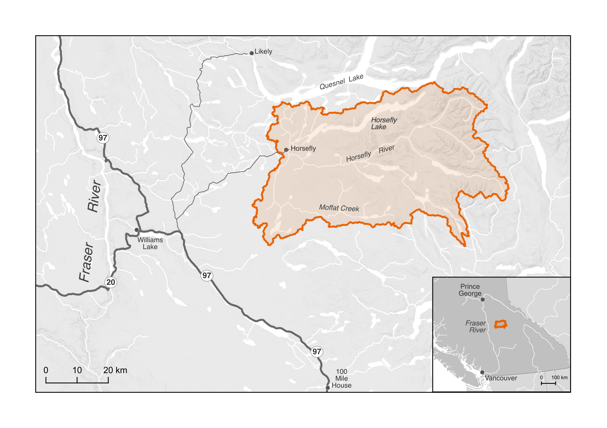
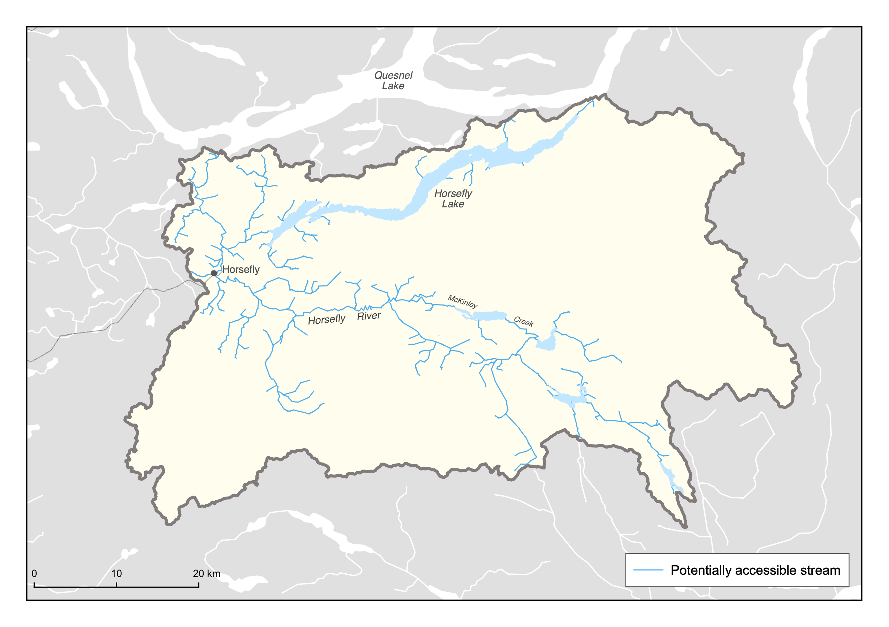

# Project Scope {#scope}

Connectivity is a critical component of freshwater ecosystems that encompasses a variety of factors related to ecosystem structure and function, such as the ability of aquatic organisms to disperse and/or migrate, the transportation of energy and matter (e.g., nutrient cycling and sediment flows), and temperature regulation (Seliger & Zeiringer 2018). Though each of these factors are important when considering the health of a watershed, for the purposes of this WCRP the term "connectivity" is defined as the degree to which aquatic organisms can disperse and/or migrate freely through freshwater systems. Within this context, connectivity is primarily constrained by physical barriers, including anthropogenic infrastructure such as dams, weirs, and stream crossings, and natural features such as waterfalls and debris flows. This plan is intended to focus on the direct remediation and prevention of localized, physical barriers instead of the broad land-use patterns that are causing chronic connectivity issues in the watershed. The planning team decided that the primary focus of this WCRP is addressing barriers to both longitudinal connectivity (i.e., along the upstream-downstream plane) and lateral connectivity (i.e., connectivity between the mainstem and adjacent riparian wetlands and floodplains) due to the importance of maintaining fish passage to spawning, rearing, and overwintering habitat in the watershed.

```{r context-map, fig.cap = "The primary geographic scope — the Horsefly River watershed, located in the Fraser River system.", fig.align = "center", echo=FALSE}

```

The primary geographic scope of this WCRP is the Horsefly River watershed, located in the upper Fraser River drainage basin in central British Columbia (Figure \@ref(fig:context-map)). The scope constitutes the Horsefly River "watershed group" as defined by the [British Columbia Freshwater Atlas (FWA)](https://catalogue.data.gov.bc.ca/dataset/freshwater-atlas-watershed-groups). A consistent spatial framework was necessary to undertake a watershed selection process at the provincial scale to identify target watersheds to improve connectivity for salmon. The Horsefly River watershed was identified by the BC Fish Passage Restoration Initiative as one of four target watersheds for WCRP development (Mazany-Wright et al. 2021b). The Horsefly River watershed has a drainage area of 276,603 ha, spanning from the Quesnel Highlands in the southeast to the confluence with Quesnel Lake in the northwest. Culturally and economically important populations of Chinook Salmon, Coho Salmon, and Sockeye Salmon are all found in the watershed, which historically supported Indigenous sustenance and trading economies (Table \@ref(tab:species-names); Williams Lake First Nation 2021, Xatśūll First Nation 2021).

```{r species-names, echo=FALSE}
library(kableExtra)
table3 = read.csv(header = TRUE, "./docs/tables/species_names.csv", fileEncoding = "UTF-8-BOM", check.names = FALSE)

kbl(table3, caption = "Target fish species in the Horsefly River watershed. The Secwepemctsín, Western common, and scientific species names are provided.") #%>%
  #column_spec(1,width = "10em") #%>%

```

The Horsefly River watershed comprises parts of Secwepemcúl’ecw, the traditional territory of the Northern Secwepemc te Qelmucw (NStQ), represented by the Northern Shuswap Tribal Council and four member communities or autonomous nations:

- Xatśūll Cmetem’ (Soda Creek First Nations)
- Stswēceḿc Xgāt’tem (Canoe Creek/Dog Creek First Nations)
- T’ēxelc (Williams Lake First Nation)
- Tsq’ēsceń (Canim Lake First Nation)

The NStQ steward the land and the waters of the Horsefly River watershed based on balance and respect between the people, the animals and fish, the land, and the plants (N. Singtha, Williams Lake First Nation, pers. comm.). It is necessary to receive permission from the member communities for any work to occur on their territory.

The geographic scope of this WCRP was further refined by identifying “potentially accessible” stream segments, which are defined as streams that target species should be able to access in the absence of anthropogenic barriers (Figure \@ref(fig:accessible-map)). Potentially accessible stream segments were spatially delineated using fish species observation and distribution data, as well as data on "exclusionary points". These include waterfalls greater than 5 m in height, gradient barriers based on species-specific swimming abilities, and watershed exclusion areas, which are portions of the watershed where barrier remediation efforts should not occur. These maps were explored by the planning team to incorporate additional local knowledge, ensure accuracy, and finalize the constraints on potentially accessible stream segments. The planning team identified certain tributaries to the mainstem Horsefly River as "watershed exclusion areas", which were excluded from further consideration under this plan, due to intermittent or insufficient flows to support restoring connectivity for the target species. The geographic scope was further refined based on several confirmed impassable waterfalls and modelled gradient barriers. Specifically, there are two impassable waterfalls that severely limit potentially accessible habitat: one on the mainstem Horsefly River approximately 4 km upstream of the confluence with McKinley Creek, and the second on Moffat Creek approximately 5 km upstream from where it flows into the Horsefly River. All stream segments not identified as potentially accessible were removed from the scope for further consideration. The "constrained geographic scope" formed the foundation for all subsequent analyses and planning steps, including mapping and modelling useable habitat types, quantifying the current connectivity status, goal setting, and action planning (Mazany-Wright et al. 2021a).

```{r accessible-map, fig.cap = "Potentially accessible stream segments within the Horsefly River watershed. These do not represent useable habitat types, but rather identifies the stream segments within which habitat modelling and barrier mapping and prioritization was undertaken.", fig.align = "center", echo=FALSE}

```


